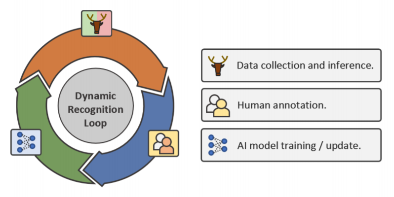

# Iterative Human and Automated Identification of Wildlife Images

## *Nature - Machine Intelligence, 2021*

[[Preprint]](https://arxiv.org/abs/2105.02320)



## Data
All raw camera trap images that were used in this study, along with the associated
annotation information, will be uploaded to the publicly-available Labeled Information
Library of Alexandria: Biology and Conservation (LILA BC) upon publication. Currently, please 
contact the [authors](zhongqi.miao@berkeley.edu) for the full data.

## Changing dataset root for training and testing
Once the data is downloaded, please change the data root in the configuration files. For 
example: `dataset_root: /Mozambique`. 

## Stage 1: pre-training and evaluation
```
python main.py --config ./configs/Stage_1/plain_resnet_MOZ_S1_101920.yaml
```
## Stage 1: energy fine-tuning
```
python main.py --config ./configs/Stage_1/energy_resnet_MOZ_S1_101920.yaml --energy_ft
```
## Stage 2: training
```
python main.py --config ./configs/Stage_2/pslabel_oltr_resnet_MOZ_S2_111120.yaml
```
## Stage 2: energy fine-tuning
```
python main.py --config ./configs/Stage_2/pslabel_oltr_energy_resnet_MOZ_S2_111620.yaml
```
## Stage 2: deploying
```
python main.py --config ./configs/Stage_2/pslabel_oltr_energy_resnet_MOZ_S2_111620.yaml --deploy
```

## Citation
```
@article{AnimalActiveLearning,
  title={Iterative Human and Automated Identification of Wildlife Images},
  author={Miao, Zhongqi and Liu, Ziwei and Gaynor, Kaitlyn M. and Palmer, Meredith S. and Yu, Stella X. and Getz, Wayne M.},
  journal={Nature - Machine Intelligence},
  year={2021}
}
```
